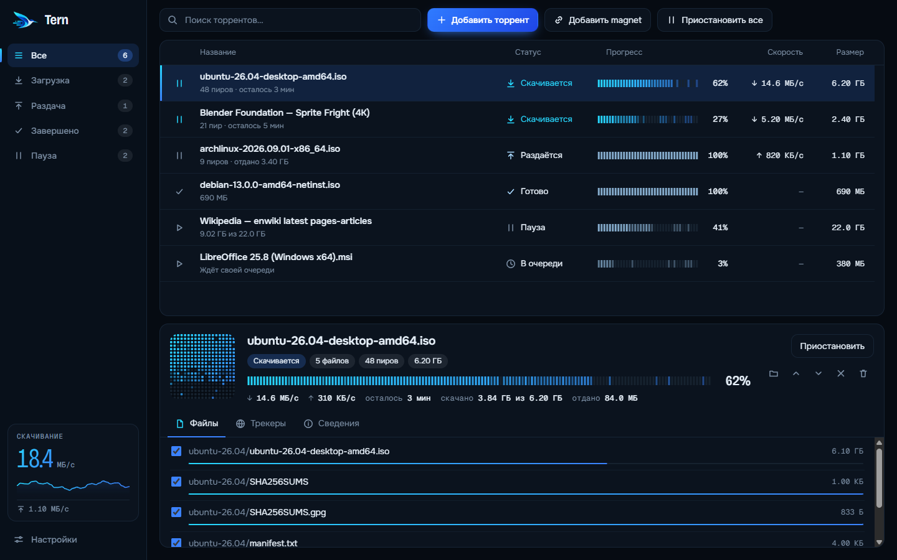

<h1 align="center">
  <br>
  Tern — a fast, minimal BitTorrent client for Windows
</h1>

<p align="center">
  <a href="https://github.com/by-sonic/tern-torrent-client/releases/latest"></a>
  <a href="https://github.com/by-sonic/tern-torrent-client/releases"></a>
  <a href="https://github.com/by-sonic/tern-torrent-client/actions/workflows/ci.yml"></a>
  <a href="LICENSE"></a>
  
</p>

<p align="center">
  <b>Tern</b> is a free, open-source <b>torrent client for Windows 10 and 11</b>. It opens <code>.torrent</code> files and <code>magnet:</code> links, lets you pick exactly which files to download, and keeps itself up to date. No ads, no bundled software, no telemetry.<br>
  <a href="#русский">Читать по-русски ↓</a>
</p>

<p align="center">
  <a href="https://github.com/by-sonic/tern-torrent-client/releases/latest"><b>⬇ Download Tern for Windows</b></a>
</p>

<p align="center">
  <picture>
    <source media="(prefers-color-scheme: light)" srcset="docs/screenshot-light.png">
    
  </picture>
</p>

## Features

- **Magnet links and `.torrent` files.** Double-click a file or click a `magnet:` link; Tern can be your default torrent client.
- **Choose what to download.** See every file in a torrent before it starts, untick what you don't need, change your mind later.
- **A live piece map.** Every download draws the real shape of the torrent as pieces arrive, in the list and as a mosaic in the details panel.
- **Speed limits and a queue.** Cap download and upload speed, choose how many torrents run at once, and reorder the queue.
- **Automatic updates.** Tern checks this repository's releases, downloads new versions in the background and installs them on restart. You can switch it off.
- **Runs in the tray.** Close the window and keep seeding; optionally start with Windows.
- **Light and dark themes** that follow Windows, a search box and sortable columns.
- **Small and private.** Peer traffic and the update check are the only network activity. Everything is stored on your computer.

> **Note:** the interface is currently in Russian only; an English UI is planned. Button names in this README are given in English.

## Install

1. Download `Tern-Setup-<version>.exe` from the [latest release](https://github.com/by-sonic/tern-torrent-client/releases/latest).
2. Run it. The installer is not code-signed yet, so Windows SmartScreen may warn you: choose **More info → Run anyway**. The SHA-256 of every installer is listed in the release notes.
3. Open Tern and click **Make default** to handle `.torrent` files and magnet links. Windows asks you to confirm, and no program can do that for you.

Requirements: 64-bit Windows 10 or 11.

## Making Tern the default torrent client on Windows 11

Windows does not let apps claim file types silently. Tern's **Make default** button registers it and opens **Settings → Apps → Default apps**; pick **Tern** for `.torrent` and for the `MAGNET` link type there.

## Automatic updates

Tern checks GitHub Releases shortly after it starts and every six hours. A new version downloads in the background; you see a banner and can restart to update, or it installs the next time you quit. Turn it off under **Settings → Check for updates automatically**. Updates are verified against the SHA-512 in the release's `latest.yml`.

## FAQ

**Is Tern free?** Yes. It is MIT-licensed open source.

**Does Tern have ads or tracking?** No. It sends no telemetry. The only connections are to peers and trackers of the torrents you add, and to GitHub for update checks.

**Which BitTorrent features does it support?** Magnet links, `.torrent` files, DHT, local peer discovery, PEX, UPnP / NAT-PMP port mapping, selective file download, speed limits and seeding. uTP and web seeds are turned off on purpose, for a simpler and safer build.

**Where do my downloads go?** Into the folder you choose in Settings (Downloads by default), or a folder you pick for a single torrent.

**Is it built on WebTorrent?** Yes. Tern uses the [WebTorrent](https://github.com/webtorrent/webtorrent) engine inside an [Electron](https://www.electronjs.org/) app.

**Windows SmartScreen warns about the installer.** Tern is not code-signed yet. Verify the installer's SHA-256 against the release notes if you want to be sure.

## Use it responsibly

Tern is a neutral tool, like a web browser. It does not host, index or recommend content. Download only what you have the right to: Linux distributions, open-source software, public-domain and Creative Commons media, and your own files.

## Build from source

```bash
git clone https://github.com/by-sonic/tern-torrent-client.git
cd tern-torrent-client
npm ci --ignore-scripts
npm test          # unit and integration tests, including a real two-client swarm
npm start         # run the app
npm run dist      # build the Windows installer into dist/
```

Node.js 22 or newer is required. `npm run screenshots` regenerates the images in `docs/`, and `npm run icons` regenerates the app icons from `assets/logo-source.png`.

Releases are built by GitHub Actions when a `v*` tag is pushed; see [CONTRIBUTING.md](CONTRIBUTING.md).

## Contributing and security

Issues and pull requests are welcome; start with [CONTRIBUTING.md](CONTRIBUTING.md). To report a vulnerability privately, see [SECURITY.md](SECURITY.md).

## License

[MIT](LICENSE) © by-sonic

---

<h2 id="русский">Русский</h2>

**Tern — быстрый минималистичный торрент-клиент для Windows 10 и 11.** Бесплатный, с открытым исходным кодом, без рекламы, лишних программ и телеметрии. Открывает `.torrent`-файлы и `magnet`-ссылки, позволяет выбрать, какие именно файлы качать, и сам обновляется.

**[⬇ Скачать Tern для Windows](https://github.com/by-sonic/tern-torrent-client/releases/latest)**

### Возможности

- **Magnet-ссылки и `.torrent`-файлы** — двойной клик по файлу или клик по ссылке; Tern можно сделать клиентом по умолчанию.
- **Выбор файлов** — перед загрузкой видно все файлы торрента, ненужные можно отключить, а позже передумать.
- **Живая карта кусков** — полоса и мозаика показывают, как торрент собирается на самом деле.
- **Лимиты скорости и очередь** — ограничение загрузки и отдачи, число одновременных загрузок, порядок очереди.
- **Автообновление** — Tern проверяет релизы этого репозитория, скачивает новую версию в фоне и ставит её при перезапуске. Отключается в настройках.
- **Работа из трея**, автозапуск вместе с Windows, светлая и тёмная темы, поиск и сортировка.

### Установка

1. Скачай `Tern-Setup-<версия>.exe` из [последнего релиза](https://github.com/by-sonic/tern-torrent-client/releases/latest).
2. Запусти установщик. Он пока без цифровой подписи, поэтому SmartScreen может предупредить: нажми **Подробнее → Выполнить в любом случае**. SHA-256 установщика указан в описании релиза.
3. В Tern нажми **Сделать по умолчанию**. Windows попросит подтвердить выбор: программы не могут назначить себя клиентом сами.

### Как сделать Tern торрент-клиентом по умолчанию в Windows 11

Кнопка **Сделать по умолчанию** регистрирует Tern и открывает **Параметры → Приложения → Приложения по умолчанию**. Выбери Tern для `.torrent` и для ссылок `MAGNET`.

### Частые вопросы

**Tern бесплатный?** Да, лицензия MIT.

**Есть ли реклама и слежка?** Нет. Сеть используется только для обмена с пирами, трекерами и для проверки обновлений на GitHub.

**На чём он написан?** Движок [WebTorrent](https://github.com/webtorrent/webtorrent) внутри приложения на [Electron](https://www.electronjs.org/).

**SmartScreen ругается на установщик.** Подписи кода пока нет; сверь SHA-256 с указанным в релизе.

### Используй ответственно

Tern — нейтральный инструмент, как браузер: он не хранит, не индексирует и не рекомендует контент. Скачивай только то, на что у тебя есть права: дистрибутивы Linux, свободное ПО, материалы с открытыми лицензиями и свои файлы.

Интерфейс сейчас на русском языке.
